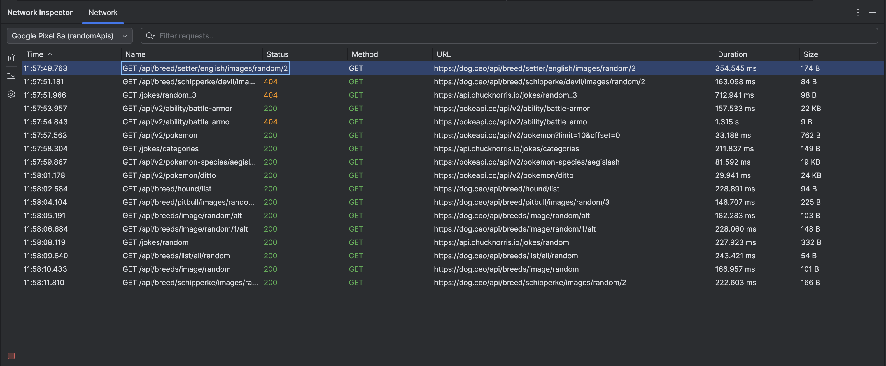
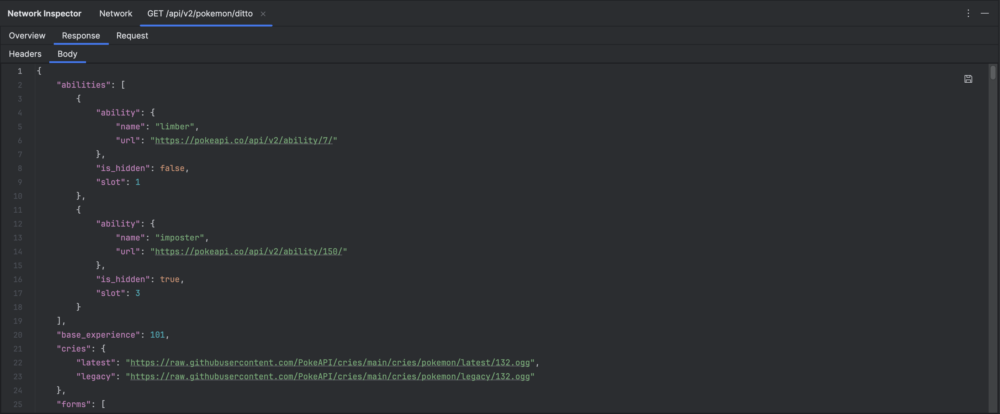

# Flocon IntelliJ Plugin

<div align="center">
    
</div>


[](https://opensource.org/licenses/MIT)
[](https://plugins.jetbrains.com/docs/intellij)

<!-- Plugin description -->
IntelliJ IDEA plugin for real-time network inspection of Android applications using the [Flocon SDK](https://github.com/openflocon/Flocon).
<!-- Plugin description end -->

---

## Features

- **Real-time Network Monitoring**: View HTTP/HTTPS requests and responses as they happen
- **Detailed Request/Response View**: Inspect headers, query parameters, request/response bodies
- **Multi-Device Support**: Monitor multiple connected Android devices simultaneously
- **Search and Filter**: Quickly find specific network calls by URL, method, or content

---

## Screenshots

### Network Timeline
View all network calls in real-time with comprehensive details including method, URL, status, duration, and size.



### Call Details
Inspect detailed request and response information including headers, query parameters, and formatted body content.



---

## Requirements

### Plugin Requirements
- **IntelliJ IDEA**: 2025.2 or later (Community or Ultimate Edition)
- **JDK**: 21 or later

### Android App Requirements
- **Flocon SDK**: Integrated in your Android app ([see installation](https://github.com/openflocon/Flocon))
- **ADB**: For device communication (usually installed with Android SDK)

---

## Installation

### From Source

1. Clone the repository with submodules:
   ```bash
   git clone --recursive https://github.com/setheclark/flocon-intellij.git
   cd flocon-intellij
   ```

2. Build the plugin:
   ```bash
   ./gradlew buildPlugin
   ```

3. Install in IntelliJ IDEA:
   - Open IntelliJ IDEA
   - **Settings → Plugins → ⚙️ (gear icon) → Install Plugin from Disk**
   - Select: `plugin/build/distributions/flocon-intellij-<version>.zip`
   - Restart IntelliJ IDEA

### From JetBrains Marketplace

*Coming soon* - The plugin will be available on the JetBrains Marketplace.

---

## Usage

### 1. Set Up Your Android App

Add the Flocon SDK to your Android app. See the [Flocon documentation](https://github.com/openflocon/Flocon) for installation instructions.

### 2. Connect Your Android Device

Connect your Android device via ADB:

```bash
# Verify device is connected
adb devices

# Should show your device:
# List of devices attached
# ABC123XYZ    device
```

### 3. Open the Plugin

1. Open IntelliJ IDEA
2. **View → Tool Windows → Network Inspector**
3. The plugin will automatically:
   - Start the WebSocket server (port 8787)
   - Detect connected ADB devices
   - Begin monitoring network traffic

### 4. Run Your App

Run your Android app on the connected device. Network calls will appear in the plugin in real-time.

### 5. Inspect Network Calls

- **Click on a network call** to view detailed request/response information
- **Use the search bar** to filter calls by URL or method
- **Select a device** from the dropdown to filter by device/app
- **Toggle auto-scroll** to control automatic scrolling to new calls
- **Click "Clear All"** to remove all network calls from the list

---

## Plugin Features

### Network Call List

- **Time**: When the request was made
- **Method**: HTTP method (GET, POST, PUT, DELETE, etc.)
- **URL**: Full request URL
- **Status**: HTTP status code (200, 404, 500, etc.)
- **Duration**: Request duration in milliseconds
- **Size**: Response size in bytes

### Detail Panel

When you select a network call, the detail panel shows:

#### Overview Tab
- Request method and URL
- Response status code and message
- Request and response timestamps
- Duration
- Response size
- Query parameters (if any)

#### Request Tab
- Request headers
- Request body (formatted JSON, XML, or raw text)
- Content type

#### Response Tab
- Response headers
- Response body (formatted JSON, XML, or raw text)
- Content type
- Compression status

### Toolbar Actions

- **🔄 Start/Stop Server**: Control the WebSocket server
- **🗑️ Clear All**: Remove all network calls
- **📜 Auto-scroll**: Toggle automatic scrolling to new calls (enabled by default)

### Filter Panel

- **Device Selector**: Choose which device/app to monitor
- **Search**: Filter calls by URL, method, or other text

---

## Configuration

### ADB Configuration

The plugin auto-detects ADB from:
1. `ANDROID_HOME` environment variable
2. Common Android SDK installation paths
3. System PATH

If ADB is not detected, you'll see a warning banner with instructions.

---

## Troubleshooting

### Plugin doesn't show network calls

1. **Verify Flocon SDK is installed** in your Android app
2. **Check ADB connection**: Run `adb devices` to verify device is connected
3. **Check server status**: Ensure the server is running (green indicator in toolbar)
4. **Check device selection**: Verify correct device/app is selected in filter panel
5. **Check app configuration**: Ensure Flocon is configured with correct server URL

### ADB not detected

1. **Install Android SDK** if not already installed
2. **Set ANDROID_HOME** environment variable:
   ```bash
   export ANDROID_HOME=/path/to/android/sdk
   ```
3. **Add ADB to PATH**:
   ```bash
   export PATH=$PATH:$ANDROID_HOME/platform-tools
   ```

### Large responses not showing

- The plugin automatically compresses large response bodies
- Very large responses (>100MB) may be truncated

### Plugin crashes or freezes

1. Check IntelliJ IDEA logs: **Help → Show Log in Finder/Explorer**
2. Report issue on [GitHub Issues](https://github.com/setheclark/flocon-intellij/issues) with:
   - IntelliJ IDEA version
   - Plugin version
   - Steps to reproduce
   - Relevant log excerpts

---

## Contributing

Contributions are welcome!

---

## License

This project is licensed under the MIT License - see the [LICENSE](LICENSE) file for details.

---

## Acknowledgments

- [Flocon SDK](https://github.com/openflocon/Flocon) - The core network inspection library

---

## Links

- **GitHub Repository**: [https://github.com/setheclark/flocon-intellij](https://github.com/setheclark/flocon-intellij)
- **Issue Tracker**: [https://github.com/setheclark/flocon-intellij/issues](https://github.com/setheclark/flocon-intellij/issues)
- **Flocon SDK**: [https://github.com/openflocon/Flocon](https://github.com/openflocon/Flocon)
- **Documentation**: [docs/](docs/)
